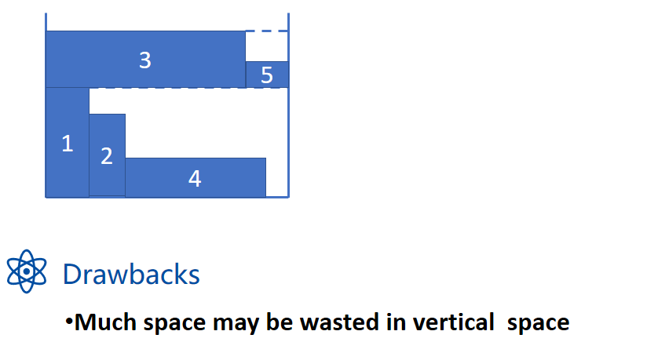
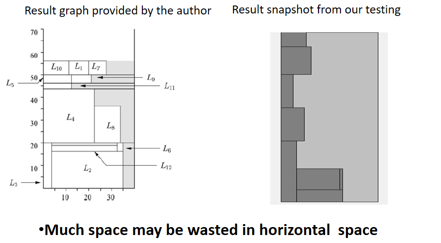
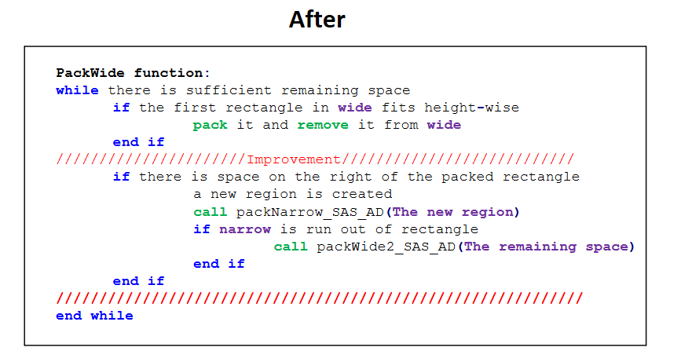

# 1. OVERVIEW
*TexturePacking*, as its name reveals, is a program that attempt to solve
the **texture packing problem** in three different **approximate algorithm**.
Especially, the last algorithm is a **authentic** one, which is a refined version of *SAS* algorithm
called *SAS_advanced* algorithm.
As a homework assigned in the **advanced data structure and algorithm analysis** course for sophomore majoring in CS,
it is an **teamwork project** for **non-comercial** purposes.  
  
  
  
# 2. PROBLEM DESCRIPTION
We are expected to pack multiple rectangles into one large texture with an approximation algorithm 
that runs in **polynomial time**. This problem has been widely discussed and dedicated the name *Strip packing problems*. 
To be exact, the problem involves packing items into a single **strip** of **fixed width** and **infinite height**, 
with the objective of **minimizing the total height** of the packing within the strip. The problem is similar 
to *Bin Packing problem*, the difference is that we can pack rectangles in **two** dimensions.  
  
  
  
There is a category of algorithms which work, called **level algorithm**. The level algorithms are **offline**, which means that we order the entire list of rectangles in advance. Then we partition the strip into **horizontal levels** with the bottom of the strip representing the first level and proceed to pack other rectangles onto these levels with certain ways.  
  
## FFDH attempt
To understand the problem better, at first, we turnt to a traditional solution. The one we has picked is called *FFDH*, *First-Fit Decreasing Height algorithm*. In fact, there are many other conventional algorithms, like *NFDH* and *BFDH*. Since they are quite similar to FFDH both in **approximation performance** and **time complexity**, we only implement FFDH without loss of generality. 
During the practice, it was observed that when **the difference of heights of rectangles** that fitted in the same level became **extreme**, the FFDH algorithm performed poorly, as shown in the following figure.  
  
  
## SAS attempt
Then we turnt to a temporary paper and applied the algorithm described on it, which is called *SAS*, *Size Alternating Stack* algorithm. In general, it maintains *two stacks* of rectangles and packs rectangles from the two stacks alternatively, in attempt to improve conventional algorithm. However, it turnt out that it worked even worse than FFDH in some test cases, with *more wasted space* in the right-most region, and *inefficient packing* both with the narrow rectangles and the wide ones.  
Following are illustrations of the algorithm and its drawbacks.  
- Algorithm  
  
  
  
  
  
  
- Drawback  
  

# 3. IMPROVEMENT
Based on SAS, we invented a new algorithm called *SAS_advanced*, which improves the efficiency of SAS a lot.  
  
  

# 4. TESTING RESULT
We demonstrate how we generate the test data first. Each case should have a known optimal height, otherwise we cannot calculate the approximation ratio. Note that when all rectangles in a test case are packed to form a complete rectangle with no gaps in it, it’s height must be the optimal one. Hence, all test cases are originated from such a complete rectangle. Without loss of genality, we simply set the width to be 200, and the height to be 180. That’s to say, the fixed width of the strip is 200 and the optimal height should be 180.  
  
For each test case, we cut randomly on that rectangle into a certain number of pieces we want, e.g. 10 pieces, 20 pieces and so on. The factors that contribute to he performance of the program are mainly:  
1. The input scale, i.e. the number of the rectangles;  
2. The rectangles shapes and their similarity.  
Since when the number of pieces getting larger and larger, those pieces will be more and more similar to one anther, i.e. their widths and their heights will be more and more alike respectively, whose effects will overweight or counteract that of the input scale. However, to keep one factor and only to changes the other factor seems too tough for us. Hence we allow those two factors changed at the same time, within a reasonale range we can still approach to the correct analysis.  
  
In addition, we use our GUI application to do the whole test.  
  
Since the SAS’s performance is too bad, and it is no need to analysis it here, we will not estimate it. You can refer to out files to see more about it’s performance.  

## Correctness
We shall first prove that the rectangles are sensibly packed by the three algorithms, 
otherwise it makes no sense to discuss on the complexity and the approximation performance.  
  

## Approximation ratio
  
  
  
## Complexity
  
  
  

# 5. LICENSE
The content of all the codes are supposed to use a licence [AGPLv3](./LICENSE)  

# 6. HOW TO CONTRIBUTE
1. Learn what is a AGPLv3, if you have not yet done so (see details above).  
2.  Create your change to the repo in question.
- Fork the desired repo, develop and test your code changes.
- Ensure that your code is clear and comprehensible.
- Ensure that your code has an appropriate set of unit tests which all pass.
3. Submit a pull request.
4. The repo owner will review your request. If it is approved, the change will be merged. If it needs additional work, the repo owner will respond with useful comments.

# 7. DECLARATION
We hereby declare that all the work done in this project titled "Texture Packing" is of our independent effort as a group.
The group members are Zhifeng Jiang(Samuel Gong) and Kewei Xu.

# 8. CREDIT
We would like to extend my sincere gratitude to my supervisor, Yue Chen, 
for her instructive advice and useful suggestions on my learning on advanced data structure and algorithm analysis.   
